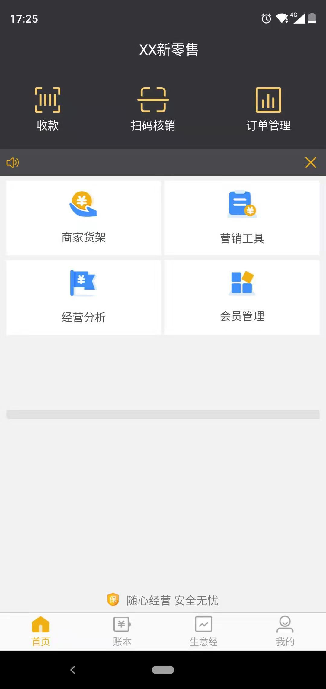

   
## XX小店（半成品Demo）

   一款基于社区超市O2O的APP。方便周边用户线上下单，店铺取货的应用。 
   
   ### 语言:
   Kotlin
   
   ### 三方库:
   Retrofit + Glide + Gson + Rxjava + RxView
   
   ### 一些组件
   hellocharts，zxing ，TabLayout， DatePicker
   
   
   感谢：
   https://github.com/git-xuhao/KotlinMvp
   
   [演示](demo_show.gif)
   
   
   
   <video id="video" controls="" preload="none" poster="demo_show.jpeg">
   <source id="mp4" src="demo_show.mp4" type="video/mp4">
   </video>
   
   
  